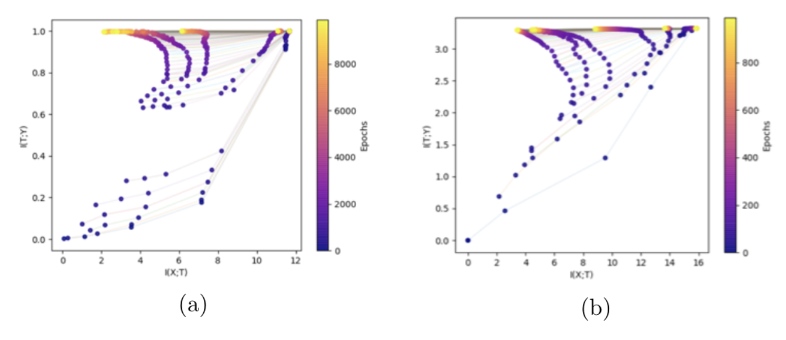

# Memorizing Information Bottleneck

[](https://travis-ci.org/joemccann/dillinger)
<br />
## Abstract
By  applying  ideas  from  information  theory  Tishby  et  al  [1]  proposed  a  novel  theoretical framework to understand Deep Neural Networks (DNNs) – the Information Bottleneck (IB). In a consecutive work Tishby et al [2] analyze the Information Plane (IP) dynamics trough the training process of a DNN and express the generalization increase in terms of MutualInformation of the inputs and the layers.  In another work by Zhang et al [3] investigated the  effective  capacity  of  DNNs,  dismissing  the  contribution  of  the  regularizers  to  explain the  generalization  capabilities  of  DNNs.   In  this  work,  I  wish  to  observe  the  capacity  and memorization capabilities of DNNs from the perspective of the IB.  

##  Introduction
###  Information Bottleneck
SGD has two consecutive phases. First, the fitting phase where the layers increase the information about the output.  Second, a much longer phase, the compression phase,the layers reduce the information about the input  

The evolution of layers on the IP (a) for the task of the binary classification with a simple DNN. (b) for multi-class classification on MNIST. The colors indicate the number of trainingepochs with SGD

### Memorization
A modification of the commonly used Euclidean loss, which helps to more reliably estimate shallow depths, as well as deep depths.

From Zhang et al [3]: Fitting random labels and random pixels on CIFAR10. (a) shows the training loss of
various experiment settings decaying with the training steps. (b) shows the relative convergence
time with different label corruption ratio. (c) shows the test error (also the generalization error since
training error is 0) under different label corruptions

## Results on Random Labels


In the upper row, the evolution of layers on the IP in thecase  of  (a)  true  labels  and  (b)  random  labels.   In  the  bottom  row,theI(X, T) of the 5 last layers in the case of (c) true labels and (d)random labels as a function of epochs

## Development
### Prerequisites
* Python 3.6
* PyTorch 1.4
* TorchVision 0.2.1
<br />

```sh
$ python -m venv venv
$ source venv/bin/activate
$ pip install -r requirements.txt
```

## Citation
```
[1]
@inproceedings{tishby2015deep,
  title={Deep learning and the information bottleneck principle},
  author={Tishby, Naftali and Zaslavsky, Noga},
  booktitle={2015 IEEE Information Theory Workshop (ITW)},
  pages={1--5},
  year={2015},
  organization={IEEE}
}
[2]
@article{shwartz2017opening,
  title={Opening the black box of deep neural networks via information},
  author={Shwartz-Ziv, Ravid and Tishby, Naftali},
  journal={arXiv preprint arXiv:1703.00810},
  year={2017}
}
[3]
@article{zhang2016understanding,
  title={Understanding deep learning requires rethinking generalization},
  author={Zhang, Chiyuan and Bengio, Samy and Hardt, Moritz and Recht, Benjamin and Vinyals, Oriol},
  journal={arXiv preprint arXiv:1611.03530},
  year={2016}
}
```
